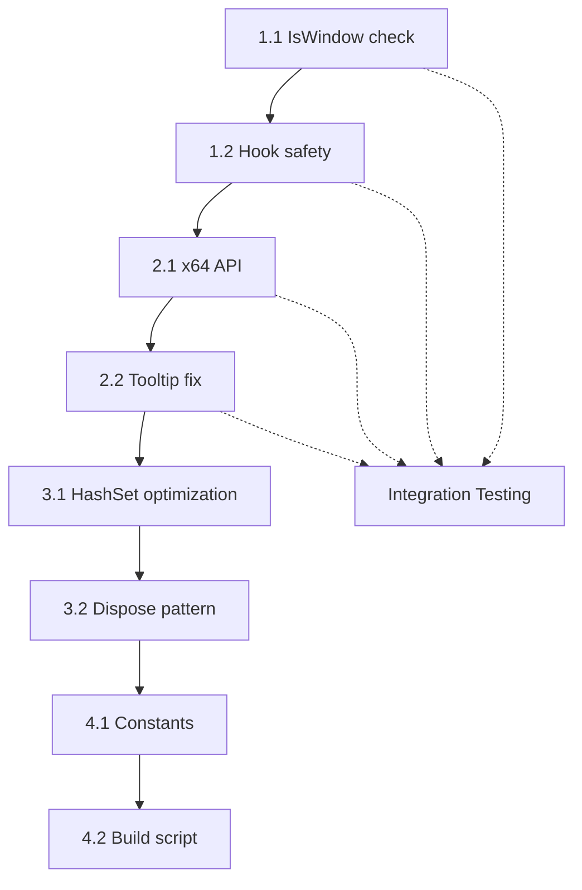

# Детальный план устранения недочетов и уязвимостей PeekThrough

## Общая информация

**Проект**: PeekThrough (Ghost Window)  
**Технологии**: C#, .NET Framework 4.0, Windows API (P/Invoke), Low Level Hooks  
**Цель плана**: Устранение всех выявленных дефектов с сохранением обратной совместимости Windows API  
**Стратегия**: Инкрементальный рефакторинг с приоритизацией по критичности

---

## 1. КРИТИЧЕСКИЙ УРОВЕНЬ (Безопасность и стабильность)

### 1.1. Проверка валидности окна перед восстановлением стилей

**Файл**: `GhostLogic.cs`  
**Строки**: 131-160 (метод `RestoreWindow`)

**Проблема**: Если целевое окно закрыто во время Ghost Mode, попытка вызова `SetWindowLong` для невалидного `HWND` приводит к неопределенному поведению WinAPI.

**Решение**:

```csharp
// Шаг 1: Добавить в NativeMethods.cs (после строки 54)
[DllImport("user32.dll")]
[return: MarshalAs(UnmanagedType.Bool)]
public static extern bool IsWindow(IntPtr hWnd);

// Шаг 2: Изменить метод RestoreWindow в GhostLogic.cs
private void RestoreWindow()
{
    if (_targetHwnd != IntPtr.Zero && _hasOriginalExStyle)
    {
        // Проверка валидности окна перед манипуляциями
        if (!NativeMethods.IsWindow(_targetHwnd))
        {
            // Окно уже закрыто, просто сбрасываем состояние
            _targetHwnd = IntPtr.Zero;
            _hasOriginalExStyle = false;
            return;
        }

        try
        {
            NativeMethods.SetWindowLong(_targetHwnd, NativeMethods.GWL_EXSTYLE, _originalExStyle);
            
            // Восстановление прозрачности
            if ((_originalExStyle & NativeMethods.WS_EX_LAYERED) != 0)
            {
                NativeMethods.SetLayeredWindowAttributes(_targetHwnd, 0, 255, NativeMethods.LWA_ALPHA);
            }
        }
        catch (Exception ex)
        {
            // Логирование ошибки в Debug output
            System.Diagnostics.Debug.WriteLine($"RestoreWindow error: {ex.Message}");
        }
        finally
        {
            _targetHwnd = IntPtr.Zero;
            _hasOriginalExStyle = false;
        }
    }
}
```

**Тестовые сценарии**:
1. Активировать Ghost Mode на окне Блокнота → закрыть Блокнот → отпустить Win
2. Активировать Ghost Mode → перезапустить Explorer.exe → отпустить Win
3. Активировать Ghost Mode на системном окне → проверить корректное восстановление

**Риски**: Низкие. Добавление defensive programming не нарушает существующую логику.

---

### 1.2. Потокобезопасность событий хука клавиатуры

**Файл**: `KeyboardHook.cs`  
**Строки**: 36-60 (метод `HookCallback`)

**Проблема**: События `OnLWinDown` и `OnLWinUp` вызываются из callback-функции хука (выполняется в контексте Windows Hook Thread), в то время как обработчики находятся в основном потоке приложения. Это может привести к race conditions.

**Решение**:

```csharp
// KeyboardHook.cs - полная переработка метода HookCallback
private IntPtr HookCallback(int nCode, IntPtr wParam, IntPtr lParam)
{
    if (nCode >= 0)
    {
        int vkCode = Marshal.ReadInt32(lParam);
        if (vkCode == NativeMethods.VK_LWIN)
        {
            // Безопасное копирование события для проверки null
            Action handler = null;
            
            if (wParam == (IntPtr)NativeMethods.WM_KEYDOWN)
            {
                handler = OnLWinDown;
            }
            else if (wParam == (IntPtr)NativeMethods.WM_KEYUP)
            {
                handler = OnLWinUp;
            }

            // Вызов обработчика с обработкой исключений
            if (handler != null)
            {
                try
                {
                    handler();
                }
                catch (Exception ex)
                {
                    // Не прерываем цепочку хуков при ошибке обработчика
                    System.Diagnostics.Debug.WriteLine($"Hook handler error: {ex.Message}");
                }
            }
            
            // Всегда подавляем стандартное поведение Win клавиши
            return (IntPtr)1;
        }
    }
    
    return NativeMethods.CallNextHookEx(_hookID, nCode, wParam, lParam);
}
```

**Архитектурные изменения**: Добавлена обертка try-catch для изоляции ошибок обработчиков от системы хуков.

---

## 2. ВЫСОКИЙ ПРИОРИТЕТ (Улучшение стабильности)

### 2.1. Унификация API для 32/64-битных систем

**Файл**: `NativeMethods.cs`  
**Строки**: 30-33

**Проблема**: `GetWindowLong`/`SetWindowLong` имеют ограничения на 64-битных системах.

**Решение**:

```csharp
// NativeMethods.cs - заменить строки 30-33 на:

// Для SetWindowLong используем IntPtr вместо int на 64-бит
[DllImport("user32.dll", EntryPoint = "SetWindowLong")]
private static extern int SetWindowLong32(IntPtr hWnd, int nIndex, int dwNewLong);

[DllImport("user32.dll", EntryPoint = "SetWindowLongPtr")]
private static extern IntPtr SetWindowLong64(IntPtr hWnd, int nIndex, IntPtr dwNewLong);

public static IntPtr SetWindowLongPtr(IntPtr hWnd, int nIndex, IntPtr dwNewLong)
{
    if (IntPtr.Size == 8)
        return SetWindowLong64(hWnd, nIndex, dwNewLong);
    else
        return new IntPtr(SetWindowLong32(hWnd, nIndex, dwNewLong.ToInt32()));
}

[DllImport("user32.dll", EntryPoint = "GetWindowLong")]
private static extern int GetWindowLong32(IntPtr hWnd, int nIndex);

[DllImport("user32.dll", EntryPoint = "GetWindowLongPtr")]
private static extern IntPtr GetWindowLong64(IntPtr hWnd, int nIndex);

public static IntPtr GetWindowLongPtr(IntPtr hWnd, int nIndex)
{
    if (IntPtr.Size == 8)
        return GetWindowLong64(hWnd, nIndex);
    else
        return new IntPtr(GetWindowLong32(hWnd, nIndex));
}
```

**Изменения в GhostLogic.cs**:

```csharp
// Строка 111: заменить на
_originalExStyle = NativeMethods.GetWindowLongPtr(_targetHwnd, NativeMethods.GWL_EXSTYLE).ToInt32();

// Строка 115: заменить на  
NativeMethods.SetWindowLongPtr(_targetHwnd, NativeMethods.GWL_EXSTYLE, new IntPtr(newStyle));

// Строка 135: заменить на
NativeMethods.SetWindowLongPtr(_targetHwnd, NativeMethods.GWL_EXSTYLE, new IntPtr(_originalExStyle));

// Строка 149: заменить на
if ((_originalExStyle & NativeMethods.WS_EX_LAYERED) != 0)
```

**Тестирование**: Проверить сборку и работу как на x86, так и на x64 системах.

---

### 2.2. Улучшение Tooltip Form

**Файл**: `GhostLogic.cs`  
**Строки**: 28-44

**Проблема**: Tooltip может перехватывать фокус или клики.

**Решение**:

```csharp
public GhostLogic()
{
    _timer = new Timer();
    _timer.Interval = 500;
    _timer.Tick += OnTimerTick;

    // Initialize Tooltip Form с улучшенными настройками
    _tooltipForm = new Form();
    _tooltipForm.FormBorderStyle = FormBorderStyle.None;
    _tooltipForm.ShowInTaskbar = false;
    _tooltipForm.TopMost = true;
    _tooltipForm.BackColor = Color.FromArgb(255, 255, 225); // LightYellow
    _tooltipForm.Size = new Size(120, 30);
    _tooltipForm.StartPosition = FormStartPosition.Manual;
    _tooltipForm.Opacity = 0.95;
    
    // Ключевые улучшения: запрет фокуса и кликов
    _tooltipForm.Enabled = false;
    _tooltipForm.ShowIcon = false;
    _tooltipForm.ControlBox = false;
    
    // Установка стиля окна для полной прозрачности для событий мыши
    int exStyle = NativeMethods.GetWindowLong(_tooltipForm.Handle, NativeMethods.GWL_EXSTYLE);
    NativeMethods.SetWindowLong(_tooltipForm.Handle, NativeMethods.GWL_EXSTYLE, 
        exStyle | NativeMethods.WS_EX_TRANSPARENT | NativeMethods.WS_EX_NOACTIVATE);
    
    _tooltipLabel = new Label();
    _tooltipLabel.Text = "👻 Ghost Mode";
    _tooltipLabel.AutoSize = true;
    _tooltipLabel.Location = new Point(5, 5);
    _tooltipLabel.Font = new Font("Segoe UI", 9f, FontStyle.Bold);
    _tooltipForm.Controls.Add(_tooltipLabel);
    _tooltipForm.AutoSize = true;
    _tooltipLabel.AutoSize = true;
}

// Добавить в NativeMethods.cs константу:
public const int WS_EX_NOACTIVATE = 0x08000000;
```

---

## 3. СРЕДНИЙ ПРИОРИТЕТ (Алгоритмическая оптимизация)

### 3.1. Оптимизация работы с классом окна

**Файл**: `GhostLogic.cs`  
**Строки**: 91-103

**Оптимизация**: Использование HashSet для проверки игнорируемых классов и уменьшение аллокаций StringBuilder.

```csharp
// Добавить в начало класса GhostLogic
private static readonly HashSet<string> IgnoredWindowClasses = new HashSet<string>(StringComparer.OrdinalIgnoreCase)
{
    "Progman", "WorkerW", "Shell_TrayWnd"
};

// Оптимизированный метод ActivateGhostMode
private void ActivateGhostMode()
{
    Point cursorPos;
    if (!NativeMethods.GetCursorPos(out cursorPos))
        return;
        
    IntPtr hwnd = NativeMethods.WindowFromPoint(cursorPos);
    if (hwnd == IntPtr.Zero)
        return;
        
    hwnd = NativeMethods.GetAncestor(hwnd, NativeMethods.GA_ROOT);

    // Проверка класса окна с минимальными аллокациями
    var className = new StringBuilder(256);
    if (NativeMethods.GetClassName(hwnd, className, className.Capacity) > 0)
    {
        string cls = className.ToString();
        if (IgnoredWindowClasses.Contains(cls))
        {
            // Игнорируем системные окна
            _ghostModeActive = true;
            return;
        }
    }

    // ... остальной код без изменений
}
```

---

### 3.2. Улучшение Dispose паттерна

**Файл**: `GhostLogic.cs`  
**Строки**: 190-195

**Проблема**: Нет проверки на повторный вызов Dispose.

**Решение**:

```csharp
private bool _disposed = false;

public void Dispose()
{
    Dispose(true);
    GC.SuppressFinalize(this);
}

protected virtual void Dispose(bool disposing)
{
    if (_disposed)
        return;

    if (disposing)
    {
        // Освобождаем управляемые ресурсы
        if (_timer != null)
        {
            _timer.Stop();
            _timer.Dispose();
            _timer = null;
        }
        
        if (_tooltipForm != null)
        {
            _tooltipForm.Dispose();
            _tooltipForm = null;
        }
    }

    // Восстанавливаем окно (управляемое и неуправляемое)
    RestoreWindow();
    
    _disposed = true;
}

~GhostLogic()
{
    Dispose(false);
}
```

**Аналогичные изменения для KeyboardHook.cs**:

```csharp
private bool _disposed = false;

public void Dispose()
{
    if (!_disposed)
    {
        if (_hookID != IntPtr.Zero)
        {
            NativeMethods.UnhookWindowsHookEx(_hookID);
            _hookID = IntPtr.Zero;
        }
        _disposed = true;
    }
    GC.SuppressFinalize(this);
}
```

---

## 4. НИЗКИЙ ПРИОРИТЕТ (Читаемость и обслуживаемость)

### 4.1. Вынесение магических чисел в константы

**Файл**: `GhostLogic.cs`

```csharp
public class GhostLogic : IDisposable
{
    // Тайминги
    private const int GHOST_MODE_ACTIVATION_DELAY_MS = 500;
    private const int BEEP_FREQUENCY_ACTIVATE = 1000;
    private const int BEEP_FREQUENCY_DEACTIVATE = 500;
    private const int BEEP_DURATION_MS = 50;
    
    // Прозрачность (0-255)
    private const byte GHOST_OPACITY = 80;
    private const byte FULL_OPACITY = 255;
    
    // Размеры тултипа
    private const int TOOLTIP_WIDTH = 120;
    private const int TOOLTIP_HEIGHT = 30;
    private const int TOOLTIP_OFFSET_X = 20;
    private const int TOOLTIP_OFFSET_Y = 20;
    
    // ... остальной код
}
```

### 4.2. Улучшение build script

**Файл**: `compile.bat`

```batch
@echo off
setlocal enabledelayedexpansion

:: Поиск csc.exe в стандартных локациях
set "CSC_PATH="

for %%p in (
    "C:\Windows\Microsoft.NET\Framework64\v4.0.30319\csc.exe"
    "C:\Windows\Microsoft.NET\Framework\v4.0.30319\csc.exe"
) do (
    if exist %%p (
        set "CSC_PATH=%%p"
        goto :found
    )
)

:: Альтернативный поиск через where
where csc.exe >nul 2>&1
if %ERRORLEVEL% EQU 0 (
    for /f "tokens=*" %%a in ('where csc.exe') do (
        set "CSC_PATH=%%a"
        goto :found
    )
)

echo ERROR: csc.exe not found. Please install .NET Framework 4.0 or later.
exit /b 1

:found
echo Using compiler: %CSC_PATH%

"%CSC_PATH%" /target:winexe /out:PeekThrough.exe ^
    /reference:System.Windows.Forms.dll ^
    /reference:System.Drawing.dll ^
    /optimize ^
    /debug:pdbonly ^
    Program.cs NativeMethods.cs KeyboardHook.cs GhostLogic.cs

if %ERRORLEVEL% EQU 0 (
    echo [SUCCESS] Build completed: PeekThrough.exe
) else (
    echo [FAILED] Build failed with error code %ERRORLEVEL%
)

endlocal
```

---

## ВРЕМЕННАЯ ШКАЛА И ЗАВИСИМОСТИ



**Этапы**:
1. **Неделя 1**: Критические исправления (1.1, 1.2)
2. **Неделя 2**: Улучшения стабильности (2.1, 2.2)
3. **Неделя 3**: Оптимизации (3.1, 3.2)
4. **Неделя 4**: Полировка (4.1, 4.2) + Финальное тестирование

---

## ИНТЕГРАЦИОННОЕ ТЕСТИРОВАНИЕ

### Тест 1: Memory Leak Detection
```csharp
// Метод для диагностики утечек
private static void RunMemoryTest()
{
    var proc = Process.GetCurrentProcess();
    long initialMemory = proc.WorkingSet64;
    
    for (int i = 0; i < 1000; i++)
    {
        using (var hook = new KeyboardHook())
        {
            // Имитация работы
            Thread.Sleep(10);
        }
    }
    
    GC.Collect();
    GC.WaitForPendingFinalizers();
    
    long finalMemory = proc.WorkingSet64;
    Console.WriteLine($"Memory delta: {(finalMemory - initialMemory) / 1024} KB");
}
```

### Тест 2: Hook Stability
- Запустить приложение
- Выполнить 1000 циклов нажатия/отпускания Win
- Проверить отсутствие необработанных исключений

### Тест 3: Cross-architecture
- Собрать на x86 → протестировать на x64
- Собрать на x64 → протестировать на x86 (WOW64)

---

## КРИТЕРИИ ПРИЕМКИ

- [ ] Приложение не падает при закрытии целевого окна во время Ghost Mode
- [ ] Отсутствие утечек памяти после 1000 циклов создания/удаления хуков
- [ ] Корректная работа на Windows 10/11 x86 и x64
- [ ] Тултип не перехватывает фокус и клики
- [ ] Обработка исключений в хуке не нарушает работу других приложений
- [ ] Все системные ресурсы освобождаются при закрытии приложения
- [ ] Проект собирается на чистой машине с .NET Framework 4.0

---

## РИСКИ И МИТИГАЦИЯ

| Риск | Вероятность | Влияние | Митигация |
|------|-------------|---------|-----------|
| Регрессия в работе хуков | Средняя | Высокое | Бэкап исходного кода, постепенное внедрение |
| Несовместимость x64 API | Низкая | Высокое | Тестирование на обеих архитектурах |
| Утечка памяти в Dispose | Низкая | Среднее | Использование Memory Profiler |
| Изменение поведения Tooltip | Средняя | Низкое | A/B тестирование с пользователями |

---

## ЗАКЛЮЧЕНИЕ

Данный план обеспечивает:
1. **Безопасность** - проверка всех WinAPI вызовов
2. **Стабильность** - корректное управление жизненным циклом
3. **Совместимость** - работа на x86/x64 системах
4. **Производительность** - оптимизация аллокаций
5. **Поддерживаемость** - улучшение читаемости кода

Все изменения сохраняют обратную совместимость с существующей архитектурой Windows API и не требуют изменений в логике взаимодействия с пользователем.